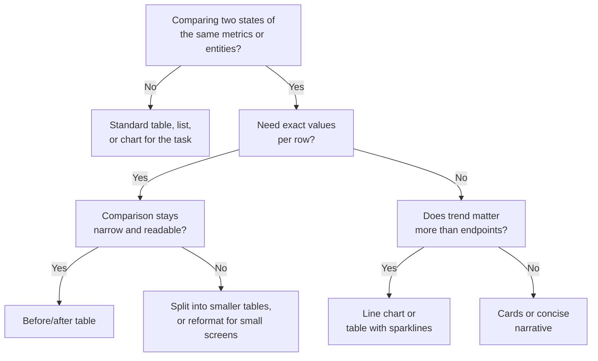

# deslop

Strip LLM tells from prose. Write plain, simple, and to the point: full sentences that read naturally aloud, ideas framed in simple terms, concrete facts over abstractions, conciseness above all. Prefer the spoken voice for word choice and rhythm, still with written grammar. Every piece of jargon gets a plain-English explanation in parentheses, and every claim that cannot be verified gets labeled as such.

TRIGGER when: writing or editing any prose deliverable (justifications, PR/commit text, docs, reports, review verdicts, README copy); or when the user asks to deslop, humanize, or de-AI a piece of text.

> **Stack assumed.** None. This skill is language-, framework-, and domain-agnostic; it governs prose, not code.

> **Scope.** Applies to prose only. Do not touch code identifiers, string literals under test, quoted third-party text, or API names that happen to contain a banned word (`robustParser`, `NavigationBar`). When editing existing text, preserve meaning exactly; this skill changes wording, never claims.

> **Precedence.** Project style guides win if they conflict. If a banned word appears in a required template heading, keep the heading.

---

## Hard rules

### 1. No em dashes

Three look-alike characters, three different rulings:

- **Hyphen `-` (U+002D): always fine.** Compound words ("read-only"), number ranges ("pages 12-14"), CLI flags, file names. The ban does not touch it.
- **Em dash `—` (U+2014) and en dash `–` (U+2013): banned in prose.** Neither may stand in for a comma, parentheses, or a colon. Replace with a period, comma, parentheses, or colon, whichever keeps the sentence natural.
- **Double hyphen ` -- `: banned when it fakes an em dash.** Fine as a literal, such as the CLI flag `--verbose`.

The only exception is technical: the character is a literal or mandated by a convention, not punctuation you chose. Keep `—` and `–` verbatim in code, commands, file names, quoted output, and third-party quotes; when documenting the characters themselves; in the cut-off dash of verbatim dialogue or a transcript ("I was about to—"); and in the attribution dash of an epigraph ("—Ursula K. Le Guin"). There is no exception for punctuating your own sentences.

| Before | After |
|--------|-------|
| `The fix is small — one line in the parser.` | `The fix is small: one line in the parser.` |
| `Tests pass — except the flaky one — so we merge.` | `Tests pass (except the flaky one), so we merge.` |

### 2. Banned words and phrases

**Filler intensifiers.** Delete or replace with the specific fact. Empty intensifiers add heat without information.

- quietly ("quietly handles", "quietly fails")
- honest / honestly / to be honest
- genuinely, really, truly, simply, just, actually (when empty: "actually works" with no contrast in play)
- crucial, vital, essential (as filler intensifiers)
- meticulous, meticulously

**Stock and corporate-register verbs.** Say the plain verb. Corporate register is a tell when the verb names tone instead of action.

- delve / delves into / dive into
- navigate / navigating (as metaphor)
- landscape (as metaphor), realm, tapestry
- leverage / leverages (use "use")
- underscore / underscoring (use "show", "prove", or name the evidence)
- highlight / highlighting (as corporate emphasis; name the fact instead)
- reflect / reflects ("this reflects our commitment" → say what changed)
- surface / surfacing (as metaphor for "raise" or "show")
- unlock, unleash, empower
- bridging the gap
- robust, seamless, seamlessly
- ship (as a verb for delivering work; say the concrete action: merge, release, include)

**Throat-clearing openers and connectors.** Prefer plain connectors, a new sentence, or starting on the fact. Delete openers that delay the claim.

- it's worth noting that, it's important to note, note that
- in essence, in summary, at its core, fundamentally
- furthermore, moreover, additionally
- not only ... but also
- whether ... or (as a rhetorical pair)
- a testament to, stands as, serves as
- "In today's ...", "At a high level,", "To be clear,", "That said," when they only stall

**Contrast frames and antithesis.** Habit, not one-strike ban. The "it's not X, it's Y" device (corrective negation) and its variants: "this isn't about X, it's about Y", "not because X, but because Y", "the problem isn't X. The problem is Y." Balanced antithesis for rhythm ("small change, large impact") is the same family. Once per document a contrast can disambiguate; as a recurring rhythm it is a tell. State what the thing is directly. Mention what it is not only when the reader would otherwise assume the wrong thing. Keep ordinary engineering negation ("do not use the admin token in CI"; "this is not a schema migration") when it prevents a real misread.

**Cadence and form tells.** Structural tells, not single words. Each is tolerable once; as a habit they mark generated text. Delete the frame and state the point plainly. Severity is "recurring rhythm," not "never use three items" or "never coordinate clauses."

- **"No X, no Y" chains and negative anaphora.** Two or more "no ..." items in a row, or short negative sentences repeating the same open ("No sign-ups, no downloads, no hassle"; "No retries. No backoff. No mercy."). Rewrite as a plain sentence or a normal list of facts.
- **"Did not X, did not Y" chains** (negative parallelism). The same with "did not" or "didn't" ("Did not flinch, did not blink, did not reach for the pen").
- **"Don't call it X, call it Y."** A negated verb plus "it", then the same verb plus "it" ("Don't call it a rewrite, call it a rescue"). Say what the thing is.
- **Rule-of-three flourishes.** Three adjectives, promises, or slogans stacked for cadence ("faster, cleaner, and more delightful"). Three real entities, tests, or criteria are fine; ban the flourish, not the count.
- **Setup/payoff constructions.** Delay the fact for theater ("Here's the surprising part…", "What happens next is…", "The twist:"). Put the fact first; context after if needed.
- **Landing sentences.** A paragraph-final punchline that re-sells or cleverly restates instead of adding a fact ("That's the real win.", "And that changes everything."). End when the fact is complete.
- **Summary beats.** Mid-doc or closing restates that rephrase what the reader already has ("In short…", "Overall…", "The takeaway is…") when no new decision or constraint follows. Covered also by rule 6 (no circling).
- **"That's the whole point / game / thing."** Drop the frame; give the point itself.
- **"X is the entire point / game / business model"** and its flip **"The entire point is ..."**. Name X directly.
- **"Sit with that (for a moment)"**, "sit with the discomfort". Therapist voice; delete it.
- **"You already know"** (the answer, what to do, or standing alone). Delete it and state the thing.
- **"The X is real, and/not ..."** ("The improvement is real, and it's not subtle"). State the measured effect instead (rule 6).
- **"The punchline is ..."**, "the punchline:", "the punchline?". Say the thing directly.
- **"It's worth naming that ..."**, "that loss is worth naming", "Worth naming:". Delete it.
- **"That's not nothing."** Say what the thing is worth.

**Sycophancy and performed enthusiasm.** Never open with Certainly!, Of course!, Great question!, Absolutely!. The same ban applies mid-response: no "you're totally right", "great point", "excellent catch", "that's a fair point". No cheerleading register: "excited to", "thrilled", "huge win", "love this", fake energy, or decorative exclamation. When the reader or user is right, act on the correction; do not praise it. Confidence is in the claim and the evidence, not in the performance.

### 3. Name the concrete thing

These words hide the actual fact behind an abstraction. Replace them with what happened.

- **drive / drives / driving** ("two strengths drive the verdict"). Name what does the thing directly: "the verdict comes down to two strengths", "the failing test is the reason".
- **gap / gaps** ("coverage gap", "deliverable gaps"). Name the missing thing: "did not add the type export", "left 7 tests failing", "includes 3 scenarios when the spec asked for several".
- **win / wins** ("a consistency win", "a small win"). Name the concrete thing: "it also updates Mutex.acquire", "it removes the dead field".
- **sell / sells / oversell / oversells** ("the writeup oversells the change"). State the mismatch plainly: "the writeup claims X, but the diff only does Y".
- **discipline / disciplined** (as a stand-in for engineering judgment). Use "implementation" when describing how cleanly the code is built.

### 4. Assume no domain knowledge

Assume the reader does not know the stack, the domain, or its vocabulary. Unless the user specifies the reader's expertise level, write for someone who lacks it: do not lean on acronyms, abbreviations, lingo, jargon, or domain-specific knowledge as if they were shared. Where a simpler word or a short explanation does the job, never reach for the complicated one.

**Gloss technical terms.** Any time a term would force the reader to look something up, follow it with a short plain-English explanation in parentheses on the same line. This applies to concurrency, transactions, locking, isolation, partial indexes, event loops, decorators, and any domain- or framework-specific term.

- **Before:** "The job uses an audio overlap window." **After:** "The job uses an audio overlap window (it re-feeds a small slice of the previous audio into the next chunk so the model has context across the boundary)."
- **Before:** "The migration adds a partial index." **After:** "The migration adds a partial index (an index that only covers rows matching a condition, so it stays small)."
- **Before:** "Writes are wrapped in a transaction." **After:** "Writes are wrapped in a transaction (either all of the writes happen or none do)."

**Expand acronyms and abbreviations on first use.** Write the full form once with the short form in parentheses, then use the short form after: "time to live (TTL)", "role-based access control (RBAC)". A short form being common in your field does not make it shared with the reader.

Gloss a term the first time it appears in a document, not on every repeat. Keep the gloss to one clause; if the explanation needs more than a line, the surrounding prose should explain it instead.

### 5. Conciseness above all

Full sentences, but no padding. Every sentence must carry a fact the reader needs. If a sentence restates the previous one or exists to sound thorough, delete it. Conciseness means fewer sentences, not compressed fragments.

**Unpack stacked noun phrases.** Three or more abstract nouns in a row usually hide who does what. Rewrite as actor + verb + object.

- Before: "the authentication session token refresh policy configuration"
- After: "the policy that controls when session tokens refresh"

**Prefer verbs over padding nominalizations.** A noun form is fine when it is the domain name (`authentication`, `isolation`, `serialization`). It is padding when it buries the action: "the implementation of the migration" → "the migration implements X" / "we implement the migration"; "utilization of the cache" → "use the cache". Ask who does what; put that verb in the sentence.

### 6. State claims once, at true strength

Three failure modes, one rule: say exactly what you can support, and say it once.

- **No overselling.** State the measured effect ("cuts p95 latency from 800ms to 200ms"), never the advertisement ("dramatically faster", "completely eliminates"). If there is no measurement, describe what the change does mechanically and stop there.
- **No doubting.** Stacked hedges ("might possibly", "it seems it could", "should probably work") and theatrical doubt read as uncertainty without content. When uncertainty is real, use one plain hedge or the [Unverified] label; when it is not, state the claim. Do not strip honest single hedges to sound confident. Verification rules win over cadence polish.
- **No circling.** Make a point once. No closing summary that restates the document, no "overall" paragraph, no rephrased second sentence saying the same thing, no landing sentence that only re-sells the paragraph.

### 7. Grammar and rhythm

- **Complete, grammatical sentences.** No fragments, no broken syntax, no verbless phrases posing as sentences. Bullets may be phrases only when every item in the list is parallel.
- **Spoken voice, written grammar.** Prefer words and rhythm that survive being read aloud: short clauses, plain verbs, concrete nouns. Still write full sentences. Do not imitate chat fragments, false starts, or stylized slogan chains (parataxis as performance). Ordinary coordination and short imperative steps are fine ("Clone the repo. Install deps. Run the tests.").
- **Vary sentence length for sense.** A run of same-shaped sentences ("X does Y. Z does W. A handles B.") reads as generated. Mix short declaratives with longer sentences that carry subordinate detail. Do not vary length at random; vary it so the important fact is easy to hear.
- **No parallel sentence stacks inside a paragraph.** Within one paragraph of prose, do not run three or more sentences with the same template (subject-verb-object clones, repeated "It …" opens, mirrored clauses). Merge into one sentence, use a list when the items are enumerable, or change the structure. Parallel shape in bullets and tables remains required when items are parallel.
- **One idea per paragraph, stated in its first sentence.** A reader skimming only first sentences should still get the whole argument. That opening sentence is scope, not a theatrical pin. Do not end the same paragraph by restating the opener in slogan form.
- **One name per thing.** Pick a name for each component, file, or concept and keep it for the whole document. Rotating synonyms ("the helper", "the utility", "the function") forces the reader to re-map.
- **Conclusions, not the journey.** "First I checked X, then I noticed Y, which led me to Z" is process narration. Write "Z, because Y." The reader needs the finding, not the tour.

### 8. Google technical writing conventions

Sentence-level rules adopted from Google's developer documentation style guide and Technical Writing One (as of 2026-07-19). Where they conflict with the rules above, the rules above win: Google permits em dashes, this skill does not.

- **Active voice.** Name the actor: "the parser rejects the input", not "the input is rejected". Passive only when the actor is unknown or irrelevant.
- **Second person in instructions.** When telling the reader what to do, write "you" or the bare imperative, not "we". "We recommend setting a timeout" becomes "set a timeout". Statements of fact ("we merged the fix") are unaffected.
- **Present tense.** Describe behavior in the present: "returns null", not "will return null". Future tense only for events actually in the future.
- **Precise verbs.** Replace "there is / there are" and weak verbs (is, occurs, happens) with the verb naming the action: "there are three ways the job fails" becomes "the job fails three ways". Same pressure as rule 5: unpack noun stacks and padding nominalizations into named actions.
- **No ambiguous pronouns.** If "it", "this", or "they" could point at more than one noun, repeat the noun.
- **One idea per sentence.** A sentence carrying two ideas becomes two sentences.
- **Conditions before instructions.** "If the build fails, check the lockfile", never "Check the lockfile if the build fails". The reader decides whether the instruction applies before reading it.
- **Serial comma.** "retries, timeouts, and backoff".

---

## Structure

Formatting is part of the prose. Decide the document's shape before writing: how many sections it needs, how deep the hierarchy goes, and what belongs in prose versus a list.

- **Prose is the default.** Use bullets only for parallel, enumerable items. Use a table only when every row is one entity carrying two or more short, non-prose values (a number, a name, a status, a short label) under shared columns, so the reader scans down a column to compare. If any column holds sentences, or a row has only one value worth showing, it is not tabular data: a two-column table whose second column is free text is a bulleted list in costume, and a bulleted list of full sentences with no parallel shape is a paragraph in costume.
- **Headers earn their place.** A heading needs at least a paragraph beneath it and a document long enough to need navigation. Never two headings in a row with nothing between them, and never a heading over a single sentence.
- **Cap the hierarchy before writing.** Decide how many nesting levels the document actually needs; two heading levels and two bullet levels cover almost any document. Needing a third level means the grouping is wrong, so restructure instead of nesting deeper.
- **Balance sections.** Sections at the same level should carry comparable weight. A three-line section beside a sixty-line sibling means merge the small one or split the large one.
- **Keep one narrative.** The document reads top to bottom as a single argument, and each section advances it. If a section could be deleted without breaking the argument, delete it.
- **Bold marks labels, not emphasis.** Bold the term a list item defines or a key the reader scans for; carry emphasis with word choice and sentence position. No exclamation marks in technical prose, no emoji, no punctuation doing decorative work.
- **Numbered lists mean sequence.** Number a list only when order matters, and start each numbered item with an imperative verb ("Run the migration"). Everything else is bulleted.
- **Sentence-case headings, descriptive links.** Capitalize only a heading's first word and proper nouns. Link text names the destination ("the retry design doc"), never "here" or "this link".
- **Open with scope.** The first paragraph states what the document covers and who it is for, so the wrong reader can stop at line three.
- **Diagrams and tables hold data; annotations hold explanation.** Inside a table cell or a diagram node, put only the label or value, kept short enough to read at a glance. Any supporting explanation goes directly below the table or diagram as an annotation (a caption, a footnote line, or a short paragraph), never crammed into cells or node text. A table whose cells wrap into multi-line prose or a diagram whose nodes hold full sentences has failed at presentation; move the prose to the annotation and shrink the structure back to labels.

### Choosing a comparison format

A before/after table is the right format only when the reader needs exact values for two states of the same entities. This tree picks the format; do not default to a table because the data happens to have two states.

When the tree lands on a before/after table (node E): keep the Before and After columns adjacent, add an explicit Delta column so the reader does not compute the difference, and use color or icons only as redundant cues on top of the values, never as the only signal.

---

## Process

When asked to deslop existing text:

1. **Scan for em dashes first.** They are the most reliable tell and mechanical to find (`—`, `–`, ` -- `). A plain hyphen `-` is never a hit. Skip hits covered by rule 1's technical exception (code, quotes, the character as subject).
2. **Sweep the banned lists** in Hard rules order. For each hit, decide: delete (filler), swap for the plain word (stock or corporate verbs), or rewrite around the concrete fact (abstraction words).
3. **Scan cadence and form tells.** Contrast frames used as rhythm, "No X, no Y" / negative anaphora, rule-of-three flourishes, setup/payoff delays, landing sentences, summary beats, performed enthusiasm. Delete the frame; keep the fact. Leave a single disambiguating contrast or a factual three-item list alone.
4. **Unpack noun stacks and padding nominalizations.** Find abstract noun piles and "the X of the Y" constructions that hide the actor; rewrite as who does what (Hard rule 5).
5. **Assume no domain knowledge.** Find every technical term, acronym, and abbreviation a non-expert reader would have to look up; gloss the terms and expand the short forms on first use (Hard rule 4).
6. **Apply the Verification rules.** Label anything unverified, timestamp versions, and strip absolute claims (prevents, guarantees, will never) that have no source. Keep one plain hedge when uncertainty is real; do not remove hedges only to sound bold.
7. **Check the structure.** Demote tables that should be bullets and bullets that should be prose, delete headings without enough content under them, flatten nesting past two levels, move prose out of table cells and diagram nodes into annotations below them, cut closing summaries that restate the document, fix title-case headings to sentence case, and rewrite "here" links to name their destination.
8. **Reread each rewritten sentence aloud-style.** Check spoken rhythm, parallel sentence stacks inside paragraphs, and same-shaped runs. If the fix produced a fragment or a comma splice that reads worse than the original, restructure the sentence instead of patching the word.
9. **Verify meaning survived.** Diff the claims, not the words: every fact in the original must still be in the result, and no new fact may appear.

When writing fresh prose, apply the rules at draft time; do not write slop and then clean it.

---

## Replacement heuristic

When a banned word or form is doing real work, the fix is never a synonym lookup or a mirrored opposite. Ask: what specific fact was this gesturing at? Write that fact.

- "robust error handling" → what does it handle? "retries on 429 and times out after 30s"
- "this is crucial" → why? "auth breaks without it"
- "seamlessly integrates" → how? "no config changes needed"
- "a coverage gap" → which one? "no test for the empty-array case"
- "this underscores the need for retries" → what failed? "without retries, the job drops events on 429"
- "the implementation of caching" → who does what? "the worker reads from the cache before calling the API"
- "It's not a rewrite, it's a rescue" → what is it? "the change restores the broken import path"

If there is no specific fact behind the word or frame, the sentence was padding. Delete it.

---

## Verification rules

1. Never present unverified content as fact.
2. If unverifiable, say: "I cannot verify this" / "I do not have access to that information" / "My knowledge base does not contain that".
3. Label unverified content: [Speculation] or [Unverified] at sentence start.
4. If any part is unverified, label the entire response.
5. Never guess or fill gaps, ask for clarification.
6. Do not paraphrase or reinterpret input unless requested.
7. For software: use the latest version, name it, include the date (e.g., "as of 2025-11-05").
8. Use web tools to confirm versions.
9. For LLM behavior: clearly state it's based on observed patterns, not internal documentation.
10. Label unless sourced: Prevent, Guarantee, Will never, Fixes, Eliminates, Ensures that.
11. If sources conflict, show each with citation.
12. Trust only official docs, direct statements, reputable publications; anything else needs [Unverified].
13. Timestamp all versions, data, releases.
14. For predictions: "I do not have access to information that allows me to verify or predict this with certainty".
15. If violated: "Correction: I previously made an unverified claim. That was incorrect and should have been labeled".
16. Never override user input without permission.

[Unverified] and [Speculation] labels are meant for a human or a model to later insert a source or verify the claim; they mark work left to do, not permanent hedges.

---

## Trust hierarchy

Official docs > Direct statements > Reputable sources > [Unverified]

A claim inherits the trust level of its weakest source. When citing, name the source at the highest tier available; when no source clears the first three tiers, the claim gets [Unverified].

---

## Anti-patterns

- ❌ **Synonym-swapping.** Replacing "delve into" with "explore" or "robust" with "resilient" keeps the tell, only the vocabulary changed. Rewrite around the concrete fact.
- ❌ **Over-correcting into fragments.** Terse is not the goal; plain is. Full sentences, plain words. Spoken voice is not chat-fragment cosplay.
- ❌ **Ban theater.** Turning every three-item list into two or four items, stripping every "not", or forbidding ordinary "and" coordination to avoid "rule of three" / "parataxis" / "negation." Ban the flourish and the recurring rhythm, not factual lists, disambiguating negation, or normal sentence coordination.
- ❌ **Confidence by deleting hedges.** Removing a real single hedge or an [Unverified] label to sound decisive violates verification. Stacked theatrical doubt goes; honest uncertainty stays.
- ❌ **Editing quoted or generated text.** Error messages, third-party quotes, and generated file content stay verbatim even when they contain banned words.
- ❌ **Changing claims while changing words.** "Oversells the change" rewritten as "the writeup is wrong" altered the claim. The rewrite must state the same mismatch: "the writeup claims X, but the diff only does Y."
- ❌ **Treating the ban list as exhaustive.** The lists cover the most common tells, not all of them. Any word or form pattern that pattern-matches to AI-generated prose (rule-of-three flourishes in every paragraph, "In today's fast-paced world" openers, paragraph-final "overall" or landing slogans, antithesis as default rhythm) falls under the same rules.
